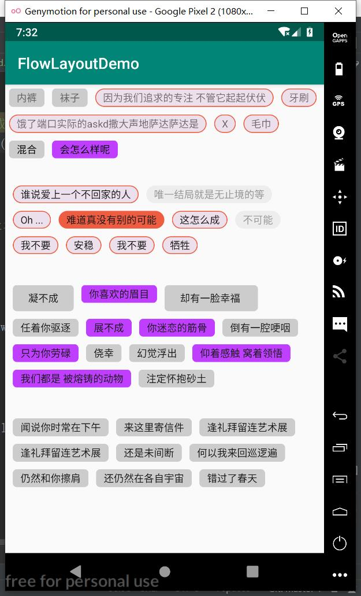
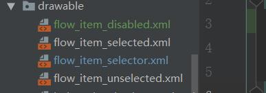
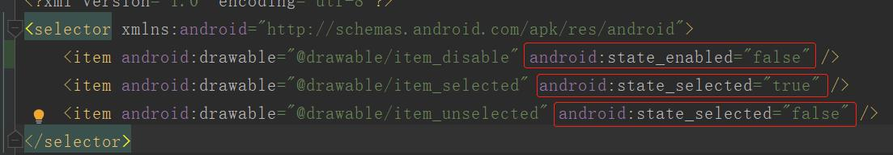

# flowlayout
a flexible android flowlayout

## 效果




## 引用

```java
implementation 'com.dreamlin.flowlayout:flowlayout:1.0.1'
```


## 属性

| 属性               | 说明                               | 示例 |
| ------------------ | ---------------------------------- | ---- |
| fontSize           | 字体尺寸，单位sp，默认13sp         | 13sp |
| fontColor          | 字体颜色，默认黑色                 |      |
| multiSelected      | 是否多选，默认false                |      |
| enableSelected     | 是否开启选择Item，默认开启         |      |
| lineSpacing        | 行间距，默认10dp                   |      |
| columnSpacing      | 列间距，默认10dp                   |      |
| defDrawable        | item drawable，默认为item_selector |      |
| childPaddingLeft   | 见名知义...                        |      |
| childPaddingTop    | 见名知义...                        |      |
| childPaddingRight  | 见名知义...                        |      |
| childPaddingBottom | 见名知义...                        |      |


## 方法

| 方法                                             | 说明                  |
| --------------------------------------------- | --------------------- |
| `setEnableSelected(boolean enableSelected)`      | 设置是否开启选择      |
| `setMultiSelected(boolean multiSelected)`        | 设置是否多选          |
| `setFontSize(int fontSize)`                      | 设置字体大小          |
| `setFontColor(int fontColor)`                    | 设置字体颜色          |
| `setColumnSpacing(int columnSpacing)`            | 设置列间距            |
| `setLineSpacing(int lineSpacing)`                | 设置行间距            |
| `setItemStateListener(FlowListener listener)`    | 设置Item监听          |
| `public List<FlowItem> getFlowItems()` | 获取所有子Item数据 |
| `public FlowItem getSelect()`                    | 获取当前选择的Item |
| `public List<FlowItem> getSelects()`             | 获取当前选中的Items |
| `public int getItemCount()`                      | 获取当前Item数量      |
| `addItem(FlowItem flowItem) `                    | 添加Item          |
| `addItem(String title)`                          | 添加Item          |
| `addItems(List<FlowItem> flowItems)`             | 添加Items     |
| `addItems(String... titles)`                     | 添加Items     |
| `addItemAt(int index, FlowItem flowItem)`        | 在指定位置插入Item    |
| `addItemsAt(int index, String... titles)`        | 在指定位置插入Item    |
| `addItemsAt(int index, List<FlowItem> items)`    | 在指定位置插入Items   |
| `addItemsAt(int index, String... titles)`        | 在指定位置插入Items   |
| `updateItemTitle(String title, String newTitle)` | 更新Item标题          |
| `updateItemTitle(int index, String newTitle)`    | 更新指定位置Item标题  |
| `updateItem(String title, FlowItem newItem) `    | 根据title更新Item信息 |
| `updateItem(FlowItem flowItem)`                  | 更新Item信息          |
| `updateItemAt(int index, FlowItem flowItem)`     | 更新指定位置Item信息  |
| `removeItem(String title)`                       | 根据标题移除Item      |
| `removeItem(FlowItem flowItem)`                  | 移除指定Item          |
| `removeItemAt(int index)`                        | 移除指定位置的Item    |


## 使用

支持xml与代码中混合使用

### 混合使用

```xml
<com.dreamlin.flowlayout.FlowLayout
    android:id="@+id/flow_mix"
    android:layout_width="match_parent"
    android:layout_height="wrap_content"
    android:padding="5dp"
    app:defDrawable="@drawable/flow_item_selector">

    <TextView
        android:layout_width="wrap_content"
        android:layout_height="wrap_content"
        android:paddingLeft="10dp"
        android:paddingTop="3dp"
        android:paddingRight="10dp"
        android:paddingBottom="3dp"
        android:text="内裤"
        android:textSize="13sp" />

    ...

    <TextView
        android:layout_width="wrap_content"
        android:layout_height="wrap_content"
        android:background="@drawable/item_selector"
        android:paddingLeft="10dp"
        android:paddingTop="3dp"
        android:paddingRight="10dp"
        android:paddingBottom="3dp"
        android:text="毛巾"
        android:textSize="13sp" />
</com.dreamlin.flowlayout.FlowLayout>
```

```java
    //代码中混合添加
    flowMix = findViewById(R.id.flow_mix);
    flowMix.addItem("混合");
    flowMix.addItem("会怎么样呢");
```

### 单选

默认就是单选，如果不需要选择item的效果，可以使用属性`app:enableSelected="false"`或者

`setEnableSelected(false);`

```xml
<com.dreamlin.flowlayout.FlowLayout
    android:id="@+id/flow_single"
    android:layout_width="match_parent"
    android:layout_height="wrap_content"
    android:layout_marginTop="30dp"
    android:padding="10dp"
    app:columnSpacing="10dp"
    app:fontColor="@color/fontDef"
    app:fontSize="13sp"
    app:lineSpacing="10dp"
    app:multiSelected="false">
```

### 多选

设置`app:multiSelected="true"`属性，或者代码里`setMultiSelected(true);`

```xml
<com.dreamlin.flowlayout.FlowLayout
    android:id="@+id/flow_multi"
    android:layout_width="match_parent"
    android:layout_height="wrap_content"
    android:layout_marginTop="30dp"
    android:padding="10dp"
    app:columnSpacing="10dp"
    app:defDrawable="@drawable/flow_item_selector"
    app:fontColor="@color/fontDef"
    app:fontSize="13sp"
    app:lineSpacing="10dp"
    app:multiSelected="true"/>
```

### 添加子Item

子Item既可以在xml里添加，也可以在代码里添加

**FlowItem**

| 属性          | 说明                                                  |
| ------------- | ----------------------------------------------------- |
| title         | 标题                                                  |
| enable        | 是否可选中，默认为true                                |
| select        | 是否选中，默认false                                   |
| position      | 在FlowLayout里的位置，该属性不可写，只有get属性       |
| drawable      | background                                            |
| fontColor     | 字体颜色，不设置默认为FlowLayout中的mFontColor        |
| fontSize      | 字体大小，单位dp，不设置默认为FlowLayout中的mFontSize |
| width         | 宽度，单位dp，默认为LayoutParams.WRAP_CONTENT         |
| height        | 高度，单位dp，默认为LayoutParams.WRAP_CONTENT         |
| paddingLeft   | 见名知意...                                           |
| paddingTop    | 见名知意...                                           |
| paddingRight  | 见名知意...                                           |
| paddingBottom | 见名知意...                                           |

#### 单个添加

```java
flowSingle.addItem("谁说爱上一个不回家的人");
flowSingle.addItem("唯一结局就是无止境的等");
flowSingle.addItem("Oh ...");
flowSingle.addItems(new String[]{"难道真没有别的可能", "这怎么成"});
flowSingle.addItems("我不要", "牺牲");
```

或者通过FlowItem添加

```java
flowSingle.addItem(new FlowItem().setTitle("不可能")
        .setDrawable(R.drawable.flow_item_selector)//可选
        .setSelect(true)//可选
        .setPadding(dp2px(20), dp2px(8), dp2px(20), dp2px(8)));//可选
```


#### 批量添加

```java
flowMulti = findViewById(R.id.flow_multi);
List<FlowItem> flowItems = new ArrayList<>();
flowItems.add(new FlowItem().setTitle("凝不成")
        .setPadding(dp2px(20), dp2px(8), dp2px(20), dp2px(8)));
flowItems.add(new FlowItem().setTitle("你喜欢的眉目")
        .setSelect(true));
flowItems.add(new FlowItem().setTitle("却有一脸幸福 ")
        .setPadding(dp2px(20), dp2px(8), dp2px(20), dp2px(8)));
flowItems.add(new FlowItem().setTitle("任着你驱逐"));
flowItems.add(new FlowItem().setTitle("展不成"));
flowItems.add(new FlowItem().setTitle("你迷恋的筋骨"));
flowItems.add(new FlowItem().setTitle("倒有一腔哽咽"));
flowItems.add(new FlowItem().setTitle("只为你劳碌"));
flowItems.add(new FlowItem().setTitle("侥幸"));
flowItems.add(new FlowItem().setTitle("幻觉浮出"));
flowItems.add(new FlowItem().setTitle("仰着感触 窝着领悟"));
flowItems.add(new FlowItem().setTitle("我们都是 被熔铸的动物"));
flowItems.add(new FlowItem().setTitle("注定怀抱砂土"));
flowItems.add(new FlowItem().setTitle("不必痴迷 传说的甘露"));
flowMulti.addItems(flowItems);
```


### 设置Item监听

```java
flowSingle.setItemStateListener(new FlowListener() {
    @Override
    public void onItemSelected(FlowItem flowItem) {
        Log.i(TAG, String.format("onItem(%d) selected:%s", flowItem.getPosition(), flowItem.getTitle()));
    }

    @Override
    public void onItemUnSelected(FlowItem flowItem) {
        Log.i(TAG, String.format("onItem(%d) unSelected:%s", flowItem.getPosition(), flowItem.getTitle()));
    }
});
```


### 自定义Item效果

可参考Demo的实现



注意要在selector中标注好状态:



在FlowLayout中设置默认的Item drawable

```xml
app:defDrawable="@drawable/flow_item_selector"
```

如果我们**不在子Item中设置Drawable**，子Item就会使用该默认drawable

如果在子Item中设置了Drawable，则使用设置的;**其他属性也是同理，优先子Item的设置**

如果觉得好用就点个Star吧，感谢~

